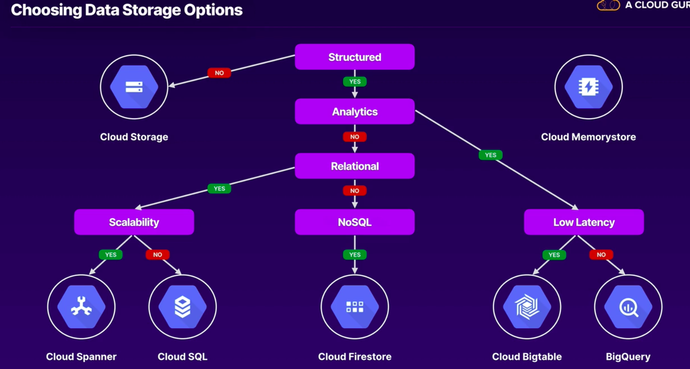
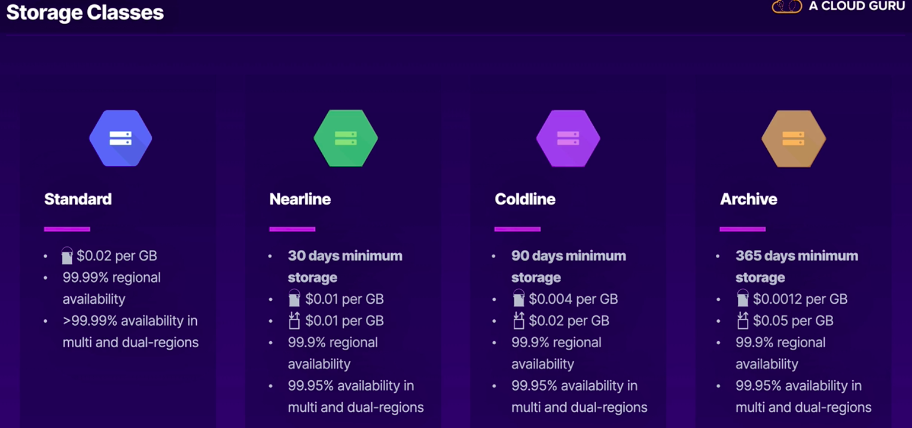
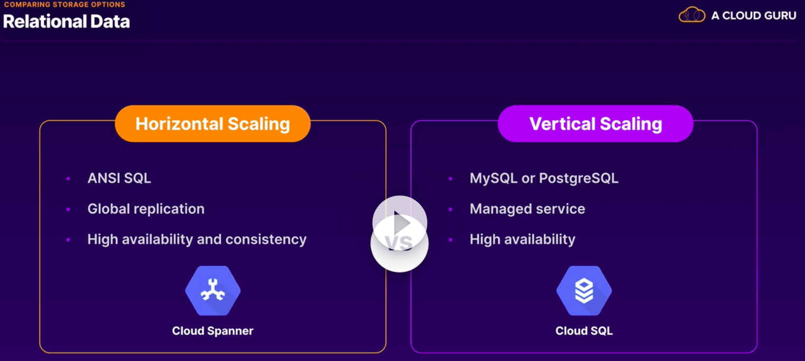
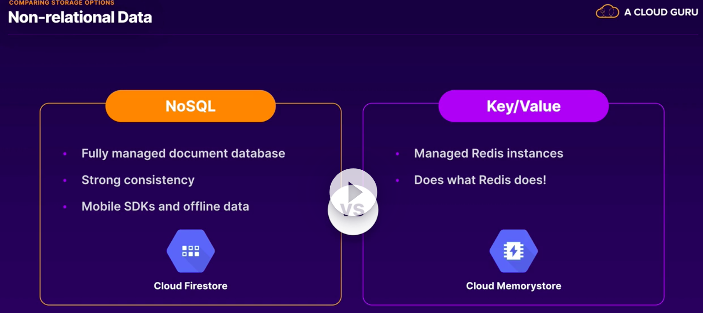
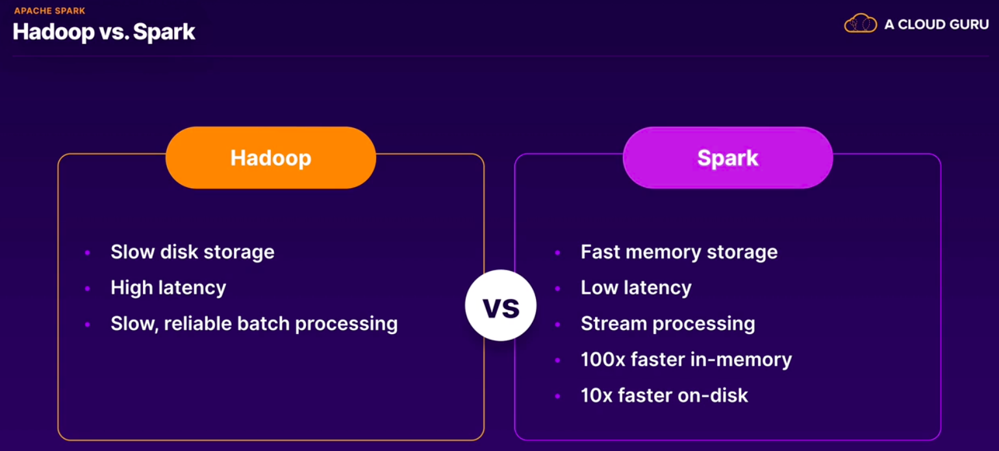
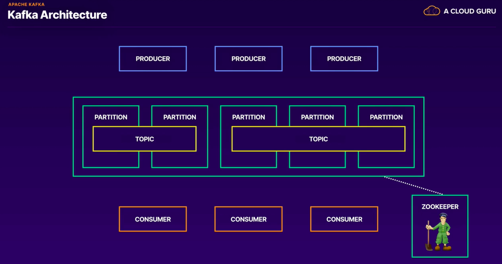
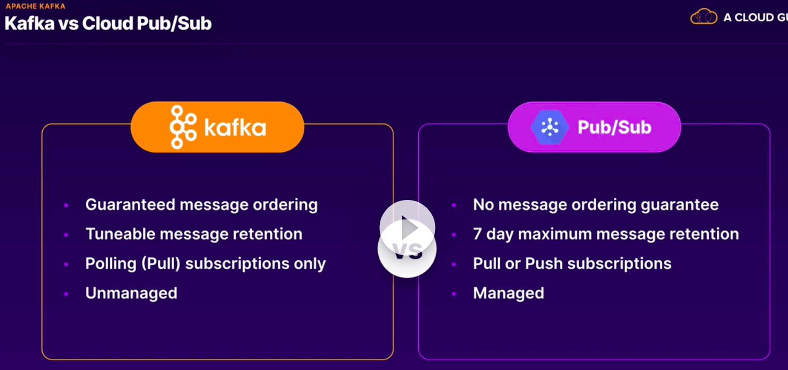
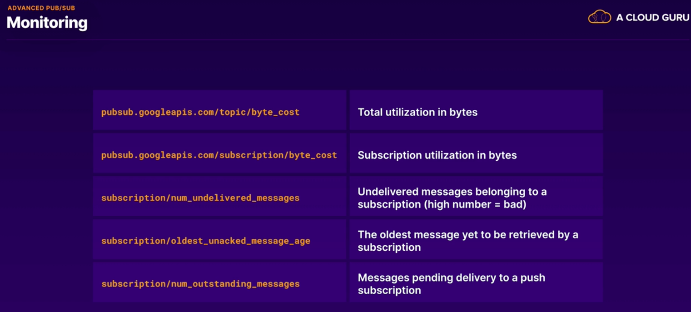
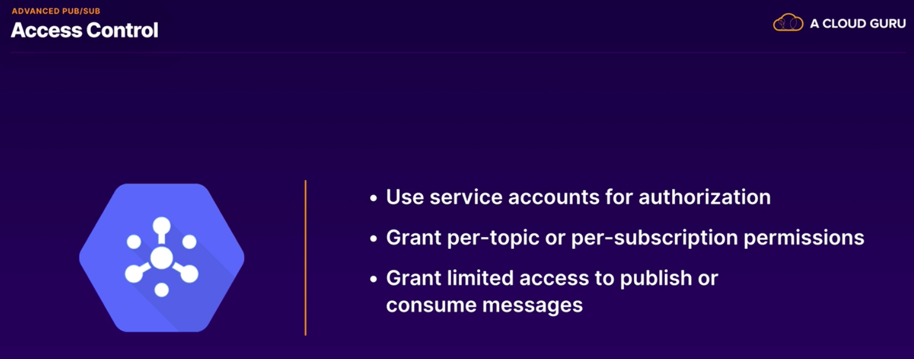

# GCP Professional Data Engineer

Repository to store study notes for the GCP Professional Data Engineer certification.

Source: [A Cloud Guru](https://acloudguru.com/course/google-certified-professional-data-engineer)

## Storage in GCP

#### **Data Processing fundamentals**

- DW: Structured and/or Processed. Ready to use.
- Data Lake: Raw and/or Unstructured. Ready to analyse. Flexible.
- OLTP: transactional. Modify.
- OLAP: analytical. Query.
- Batch: time window to load data.
- Streaming: continuous collection of data. Can you micro-batches.
- Data Pipeline:
  - Ingestion: batch or streaming. 
  - Storage.
  - Processing: ETL/ELT. Formatting, labeling, filtering, validating etc. 
  - Visualization. Decision making. 

#### **Storage and Databases**

- Choosing data options:

- **Cloud Storage**:
  - Unstructured object storage.
  - Regional, dual-region or multi-regio.
  - Standard, nearline and coldline.
  - Storage event triggers.
  - Buckets exist within projets.
  - Objects are immutable.
  - Overwrite are atiomic.
  - Access: Console, HTTP API, SDK, gsutil cli.
  - Integrity checking. 
  - Parallel uploads of composite objects.
  - Requestor pays.
  - Charges: Operation, Network, Data retrieval.
  - Lifecycle management.
  - IAM for bukl access to buckets.
  - ACLs for granular access.
  - Signed URLs.
  - Signed policy documents to set what kinds of files can be uploaded.

- **Cloud BigTable**:
  - Petabyte-scale NoSQL Database.
  - High-throughput and scalability.
  - Wide column key/value data.
  - Time-series, transacional, IoT data. 

- **Big Query**:
  - Petabyte-scala data warehouse.
  - Fast SQL queries on large datasets.

- **Cloud Spanner**:
  - Global SQL based relational database.
  - Strong consistency.
  - Horizontal scalability and high availability. 
  - Financiual transactions.
  - There is no AWS service do compare. Cloud Spanner is a leader. 
  - Horizontally scalable and High available.
  - Regional or multi-regional.
  - Parent-child relationships.
  - Interleaved table.

- **Cloud SQL**:
  - Managed MySQL, SQL Server and PostgreSQL instances. 
  - Built-in backups, replicas and failover. 
  - Vertically scalable. 
  - Not fully managed. 
  - Automate instance and database creation, replciation, backups, patches and updates.
  - Scalability and availability: vertically scale to 64 cores and 416GB RAM. Live migration and HA configs.
  - Unsupported features:
    - User defined functions.
    - InnoDB memcached plugin.
    - Federated engine.
    - SUPER privilege. 
  - Importing MySQL Data:
    - InnoDB mysqldump export/import.
    - CSV import.
    - External replica promotion.

- **Cloud Firestore**:
  - Fully-managed NoSQL document database.
  - Large collections of small JSON documents. 
  - Realtime database with mobile SDKS.
  - Dynamic schema.
  - Simple queries.
  - Scales horizontally.
  - Serverless NoSQL document store.
  - Document = json data.
  - Data types: string, integer, boolean, float, null, bytes, date and time, geographical point, array and map. Reference.

- **Memorystore**:
  - Cache.
  - Managed Redis instances.
  - In-memory DB, cache or message broker.
  - Built-in high availability.
  - Vertically scalable. 
  - Compare to amazon elastic cache.
  - Fully managed Redis instance.
  - Basic and standard tier.
  - Use cases: session cache.

- Managing Data:
  - Sources ans sinks.
  - Structured or unstructured.
  - Batch or streaming.
  - Data modeling:
    - Conceptual.
    - Logical. 
    - Physical. 
  - Relational: good relational schema design. 
    - Normalization and reducing waste. 
    - Accuracy and integrity.
    - Primary Keys and tables.

- **Service Account**:
  - Human: auth with their own credentials.
  - Automate tasks: service accounts. 
  - Identity can be assumed by an app/workload.
  - Scopes: set of users. 
  
- **Data Transfer Services**:
  - Cloud Storage Transfer Service.
    - Scheduled and periodic.
    - Filters based on names and dates.
    - Delete obj in source and destination.
    - Full access: storagetransfer.admin
    - Submit transfer: storagetransfer.user
    - List jobs and operations: storagetransfer.viewer. 

  - BigQuery Data Transfer Service:
    - Automates data transfer to BQ.
    - Data loaded on a regular basis.
    - Backfills can recover from gaps and outages. 

  - Transfer Appliance:
    - Physical rackable storage device. 
    - Ship the full device back to Google. 

- **Choosing Storage Options**:

- **Exam Tips**:
  - Choose de rith product. Memorise the flow chart.
  - Consider the business requirement. Do not just pick the best tech solution. Provably there will be multiple answers that will fulfill the tech requirements but only one will fulfill the non-tech requirement.
  - Get to know the ecosystem (hadoop).
  - Do not over look security. Learn about the different  IAM roles for each service, and in particular how you would use them to separate users who can write data from those who just need to read data. 

## Big Data Ecosystem.

- MapReduce:
  - Programming model. Map and reduce functions.
  - Distributed implementation.
  - Created at Google. 

- Hadoop and HDFS:
  - Open source implementation of mapreduce. 
  - Hadoop Common, Hadoop HDFS, Hadoop Yarn, Hadoop MapReduce. 

- Apache Pig:
  - Platform for analysing large datasets.
  - Pig Latin defines analytics jobs.
  - An abstraction for mapreduce.
  - ETL. 

- Apache Spark:
  - Limitations of mapreduce:
    - Linear dataflow. Slow.
  - Spark:
    - General purpose cluster-computing framework.
    - RDDs. 
    - Spark Core: SparkSQL, Spark Streaming, Spark MLLib, Spark Graph X.
    - Java, Scala, Python, R.
    - Cluster Manager, Storage System.

- Apache kafka:
  - Publish/subscribe to streams of records. 
  - Message bus, but for data. 
  - High throughput and low latency. 
  - Four main APIs: Producer, Consumer, Streams and Connector.

## Real Time Messaging with Pub/Sub

- Messagaging Middleware: decouple applications. 
  - Without it, the system do not have resiliency. 

- PUB/SUB:
  - Global messaging and event ingestion.
  - Serverless and fully-managed. 
  - Multiple publisher/subscriber patterns.
  - Ate least once delivery.
  - Real time or batch.
  - Integrate with dataflow, cloud functions, cloud run etc.
  - Use cases:
    - Distributing workloads.
    - Asynchronous workflows.
    - Device data streaming.
    - Distributing event notifications.

- PUB/SUB Basics.
  - One to one, many to many, one to many etc. 
  - Message 10 MB or less.
  - Pull is the default delivery method. 
  - Messages must be acknowledge.
  - Push will send messages to an endpoint.
  - Must be HTTPS with valid SSL cert. 
  - A push Subscription endpoint must accept an HTTPS POST with a valid SSL certificate. It must also be configured to use an authentication header.
  - gcloud pubsub topics list.
  - Pub/Sub is designed for:
    - To enable asynchronous workflows.
    - To decouple services and distribute workloads.
    - To receive, buffer and distribute events.
    - To receive, buffer and distribute data.

- Advanced features:
  - Each message is delivered at least once for every subscription.
  - Undelivered messages are deleted after the message retention period duration (by default 7 days).
  - Minimum retation periodo: 10 minutes.
  - Messages published before a subscription is created will not be delivered to that subscription.
  - Subscription expire after 31 days of inactivity (by default).
  - New subscription with the same name have no relationship to the previous subscription.
  - Acknowledge messages are no longer available to subscribles.
  - Every message must be processed by a subscription.
  - Order: messages may not be received in order. Can use timestamps to reorder the messages at the application.
  - Messages are stored in the nearest region by default. 
  - Most granular level for which you can configure access control for Pub/Sub: Across individual topics and subscription.

- **Exam Tips**:
  - Decouple data:
    - Try to spot where Pub/Sub would be good fit to decouple components that would normally send data directly to each other. Pub/Sub can be a shock absorber, receiving data globally and allowing it to be consumed by other components at their own pace. 
  - Decouple services.
    - Try to spot where Pub/Sub can add event logic to a stack. Pub/Sub can pass events from one system to another, ir order to create asynchronous workflows.
  - Limitations:
    - Pub/Sub has unrivalled capacity and latency globally but it has certain limitations. Message data must be 10 MB or less in size, and you need to be mindful of the expiry time of undelivered messages and unused subscriptions.
  - Kafka:
    - If Kafka comes up in the exam, PUB/SUB may be a great cloud service to replace it with, especially if a case studay calls for managed cloud service to be embraced. But kafka has a much broader feature set, so make sure Pub/Sub still meets the necessary technical requirements. 
  - Cloud IoT:
    - Cloud IoT Core manages secure device registration and connection, but all messages are handled by Cloud Pub/Sub.
  - Cloud Taks *search.
  - Browse reference architectures.
    - Pub/Sub is normally the glue that holds together a data pipeline or other asynchronous workflow in a stack. Look at the smart analytical reference architectures to see how Pub/Sub works with other GCP products and services. 

## Pipelines with Dataflow

