# GCP Professional Data Engineer

Repository to store study notes for the GCP Professional Data Engineer certification.

Source: [A Cloud Guru](https://acloudguru.com/course/google-certified-professional-data-engineer)

## Storage in GCP

#### **Data Processing fundamentals**

- DW: Structured and/or Processed. Ready to use.
- Data Lake: Raw and/or Unstructured. Ready to analyse. Flexible.
- OLTP: transactional. Modify.
- OLAP: analytical. Query.
- Batch: time window to load data.
- Streaming: continuous collection of data. Can you micro-batches.
- Data Pipeline:
  - Ingestion: batch or streaming. 
  - Storage.
  - Processing: ETL/ELT. Formatting, labeling, filtering, validating etc. 
  - Visualization. Decision making. 

#### **Storage and Databases**

- Choosing data options:

- **Cloud Storage**:
  - Unstructured object storage.
  - Regional, dual-region or multi-regio.
  - Standard, nearline and coldline.
  - Storage event triggers.
  - Buckets exist within projets.
  - Objects are immutable.
  - Overwrite are atiomic.
  - Access: Console, HTTP API, SDK, gsutil cli.
  - Integrity checking. 
  - Parallel uploads of composite objects.
  - Requestor pays.
  - Charges: Operation, Network, Data retrieval.
  - Lifecycle management.
  - IAM for bukl access to buckets.
  - ACLs for granular access.
  - Signed URLs.
  - Signed policy documents to set what kinds of files can be uploaded.

- **Cloud BigTable**:
  - Petabyte-scale NoSQL Database.
  - High-throughput and scalability.
  - Wide column key/value data.
  - Time-series, transacional, IoT data. 

- **Big Query**:
  - Petabyte-scala data warehouse.
  - Fast SQL queries on large datasets.

- **Cloud Spanner**:
  - Global SQL based relational database.
  - Strong consistency.
  - Horizontal scalability and high availability. 
  - Financiual transactions.
  - There is no AWS service do compare. Cloud Spanner is a leader. 
  - Horizontally scalable and High available.
  - Regional or multi-regional.
  - Parent-child relationships.
  - Interleaved table.

- **Cloud SQL**:
  - Managed MySQL, SQL Server and PostgreSQL instances. 
  - Built-in backups, replicas and failover. 
  - Vertically scalable. 
  - Not fully managed. 
  - Automate instance and database creation, replciation, backups, patches and updates.
  - Scalability and availability: vertically scale to 64 cores and 416GB RAM. Live migration and HA configs.
  - Unsupported features:
    - User defined functions.
    - InnoDB memcached plugin.
    - Federated engine.
    - SUPER privilege. 
  - Importing MySQL Data:
    - InnoDB mysqldump export/import.
    - CSV import.
    - External replica promotion.

- **Cloud Firestore**:
  - Fully-managed NoSQL document database.
  - Large collections of small JSON documents. 
  - Realtime database with mobile SDKS.
  - Dynamic schema.
  - Simple queries.
  - Scales horizontally.
  - Serverless NoSQL document store.
  - Document = json data.
  - Data types: string, integer, boolean, float, null, bytes, date and time, geographical point, array and map. Reference.

- **Memorystore**:
  - Cache.
  - Managed Redis instances.
  - In-memory DB, cache or message broker.
  - Built-in high availability.
  - Vertically scalable. 
  - Compare to amazon elastic cache.
  - Fully managed Redis instance.
  - Basic and standard tier.
  - Use cases: session cache.

- Managing Data:
  - Sources ans sinks.
  - Structured or unstructured.
  - Batch or streaming.
  - Data modeling:
    - Conceptual.
    - Logical. 
    - Physical. 
  - Relational: good relational schema design. 
    - Normalization and reducing waste. 
    - Accuracy and integrity.
    - Primary Keys and tables.

- **Service Account**:
  - Human: auth with their own credentials.
  - Automate tasks: service accounts. 
  - Identity can be assumed by an app/workload.
  - Scopes: set of users. 
  
- **Data Transfer Services**:
  - Cloud Storage Transfer Service.
    - Scheduled and periodic.
    - Filters based on names and dates.
    - Delete obj in source and destination.
    - Full access: storagetransfer.admin
    - Submit transfer: storagetransfer.user
    - List jobs and operations: storagetransfer.viewer. 

  - BigQuery Data Transfer Service:
    - Automates data transfer to BQ.
    - Data loaded on a regular basis.
    - Backfills can recover from gaps and outages. 

  - Transfer Appliance:
    - Physical rackable storage device. 
    - Ship the full device back to Google. 

- **Choosing Storage Options**:

- **Exam Tips**:
  - Choose de rith product. Memorise the flow chart.
  - Consider the business requirement. Do not just pick the best tech solution. Provably there will be multiple answers that will fulfill the tech requirements but only one will fulfill the non-tech requirement.
  - Get to know the ecosystem (hadoop).
  - Do not over look security. Learn about the different  IAM roles for each service, and in particular how you would use them to separate users who can write data from those who just need to read data. 

## Big Data Ecosystem.

- MapReduce:
  - Programming model. Map and reduce functions.
  - Distributed implementation.
  - Created at Google. 

- Hadoop and HDFS:
  - Open source implementation of mapreduce. 
  - Hadoop Common, Hadoop HDFS, Hadoop Yarn, Hadoop MapReduce. 

- Apache Pig:
  - Platform for analysing large datasets.
  - Pig Latin defines analytics jobs.
  - An abstraction for mapreduce.
  - ETL. 

- Apache Spark:
  - Limitations of mapreduce:
    - Linear dataflow. Slow.
  - Spark:
    - General purpose cluster-computing framework.
    - RDDs. 
    - Spark Core: SparkSQL, Spark Streaming, Spark MLLib, Spark Graph X.
    - Java, Scala, Python, R.
    - Cluster Manager, Storage System.

- Apache kafka:
  - Publish/subscribe to streams of records. 
  - Message bus, but for data. 
  - High throughput and low latency. 
  - Four main APIs: Producer, Consumer, Streams and Connector.

## Real Time Messaging with Pub/Sub

- Messagaging Middleware: decouple applications. 
  - Without it, the system do not have resiliency. 

- PUB/SUB:
  - Global messaging and event ingestion.
  - Serverless and fully-managed. 
  - Multiple publisher/subscriber patterns.
  - Ate least once delivery.
  - Real time or batch.
  - Integrate with dataflow, cloud functions, cloud run etc.
  - Use cases:
    - Distributing workloads.
    - Asynchronous workflows.
    - Device data streaming.
    - Distributing event notifications.

- PUB/SUB Basics.
  - One to one, many to many, one to many etc. 
  - Message 10 MB or less.
  - Pull is the default delivery method. 
  - Messages must be acknowledge.
  - Push will send messages to an endpoint.
  - Must be HTTPS with valid SSL cert. 
  - A push Subscription endpoint must accept an HTTPS POST with a valid SSL certificate. It must also be configured to use an authentication header.
  - gcloud pubsub topics list.
  - Pub/Sub is designed for:
    - To enable asynchronous workflows.
    - To decouple services and distribute workloads.
    - To receive, buffer and distribute events.
    - To receive, buffer and distribute data.

- Advanced features:
  - Each message is delivered at least once for every subscription.
  - Undelivered messages are deleted after the message retention period duration (by default 7 days).
  - Minimum retation periodo: 10 minutes.
  - Messages published before a subscription is created will not be delivered to that subscription.
  - Subscription expire after 31 days of inactivity (by default).
  - New subscription with the same name have no relationship to the previous subscription.
  - Acknowledge messages are no longer available to subscribles.
  - Every message must be processed by a subscription.
  - Order: messages may not be received in order. Can use timestamps to reorder the messages at the application.
  - Messages are stored in the nearest region by default. 
  - Most granular level for which you can configure access control for Pub/Sub: Across individual topics and subscription.

- **Exam Tips**:
  - Decouple data:
    - Try to spot where Pub/Sub would be good fit to decouple components that would normally send data directly to each other. Pub/Sub can be a shock absorber, receiving data globally and allowing it to be consumed by other components at their own pace. 
  - Decouple services.
    - Try to spot where Pub/Sub can add event logic to a stack. Pub/Sub can pass events from one system to another, ir order to create asynchronous workflows.
  - Limitations:
    - Pub/Sub has unrivalled capacity and latency globally but it has certain limitations. Message data must be 10 MB or less in size, and you need to be mindful of the expiry time of undelivered messages and unused subscriptions.
  - Kafka:
    - If Kafka comes up in the exam, PUB/SUB may be a great cloud service to replace it with, especially if a case studay calls for managed cloud service to be embraced. But kafka has a much broader feature set, so make sure Pub/Sub still meets the necessary technical requirements. 
  - Cloud IoT:
    - Cloud IoT Core manages secure device registration and connection, but all messages are handled by Cloud Pub/Sub.
  - Cloud Taks *search.
  - Browse reference architectures.
    - Pub/Sub is normally the glue that holds together a data pipeline or other asynchronous workflow in a stack. Look at the smart analytical reference architectures to see how Pub/Sub works with other GCP products and services. 

## Pipelines with Dataflow

- ETL tool.
- Fully managed, serverless.
- Uses open source Apache Bean SDK.
- Support expressive SQL, Java and Python APIs.
- Real time and batch processing.
- Stackdriver integration.

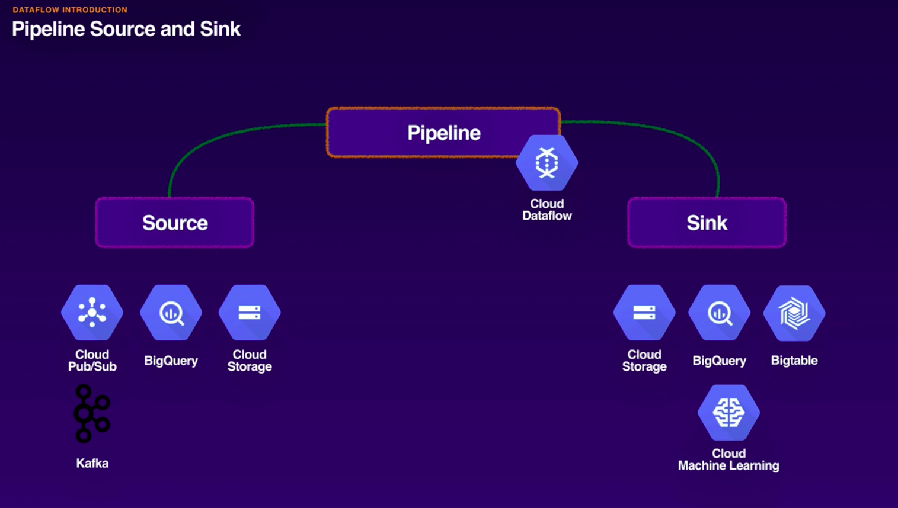

- Driver programm defines the pipeline and are submitted tio the runner. 

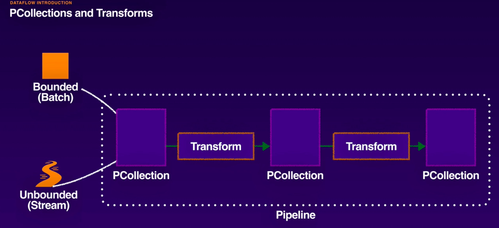

- Pipeline lifecycle:
  - Design.Create.Test.
  - Considerations for design:
    - Location of data.
    - Input data structure and format.
    - Transformation objectives.
    - Output data structure and lcoation.
    - Basic or Branching pipelines. 
    -  Driver Program (design time):
      - Create pipeline object.
      - Create a PCollection using or create transform.
      - Apply multiple transforms as required.
      - Write out final PCollectin.

- Dataflow Pipelines Concepts:
  - ParDo: 
    - Parallel Do

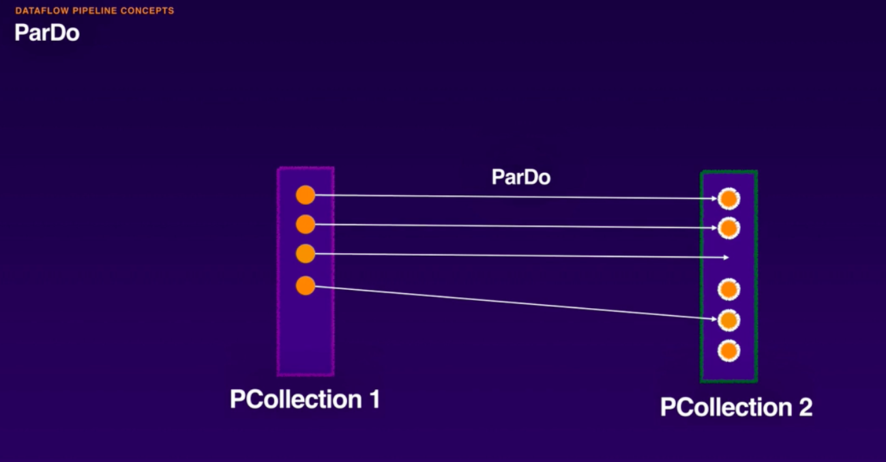

  - Aggregation:

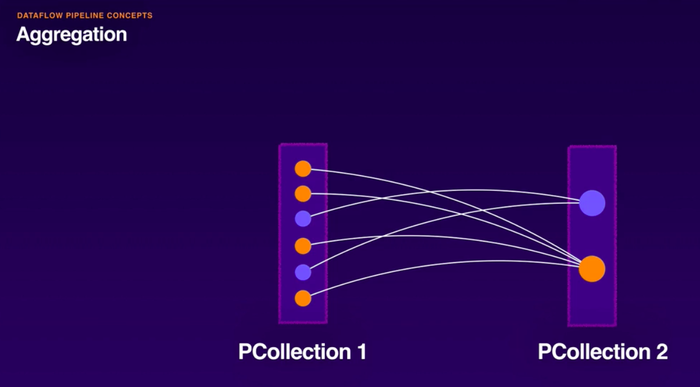

  - Characteristics of PCollection:
    - Data types.
    - Access.
    - Immutability.
    - Boundedness.
    - Timestamp.

  - Tranforms:
    - PardO.
    - GroupByKey.
    - CoGroupByKey.
    - Combine.
    - Flattern.
    - Partition.

- Advanced Datafllow concepts. 
  
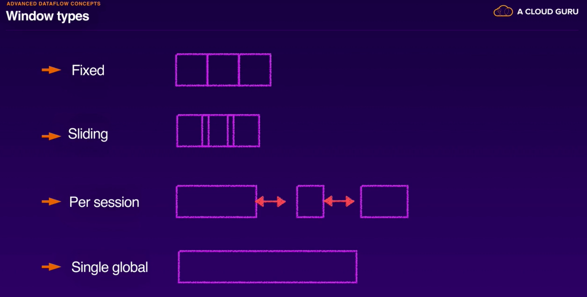

  - Trigger types:
    - Event time.
    - Processing time.
    - Data-driven.
    - Composite. 

- Dataflow security and access.
  - Dataflow run: locally, cloud dataflow managed service. 
  - Cloud dataflow service account: 
    - Automatically created.
    - Manipules job resources.
    - Service agent role.
    - Read/write access to project resources.
    - Name:
      - service<project-number>@dataflow-service-producer-prod.iam.gserviceaccount.com.
  - Controller service account:
    - Used by workers (created by the jobs).
    - Compute Engine Instances.
    - Metadata operations. 
    - User-managed controller service account.
    - <project-number>-compute@developer.gserviceaccount.com.

- Using dataflow.
  - Regional endpoint:
    - Default: us-central-1.
    - Manages metadata about cloud data flow jobs.
    - Controls Cloud Dataflow workers.
    - Automatically selects best zone. 
    - Customer-managed encryption keys.
    - Flexible Resource Scheduling (FlexRS).
      - Advanced scheduling.
      - Cloud Dataflow Shuffle Service.
      - Preemtible VMs.
    - Migrating MapReduce jobs to Cloud Dataflow.
    - Cloud Dataflow with Pub/sub Seek.
    - Dataflow SQL:
      - Develop and run Cloud Dataflow jobs from BQ web UI.
      - Dataflow SQL (ZetaSQL variant) integrates with Apache Beam SQL.
      - Apache Beam SQL:
        - Query bounded and unbounded PCollections.
        - Query is converted to a SQL transform.
      - Cloud Dataflow SQL:
        - Utilise existing SQL skills.
        - Join streams with BQ tables.
        - Query streams or static datasets.
        - Write output BQ for analysis.

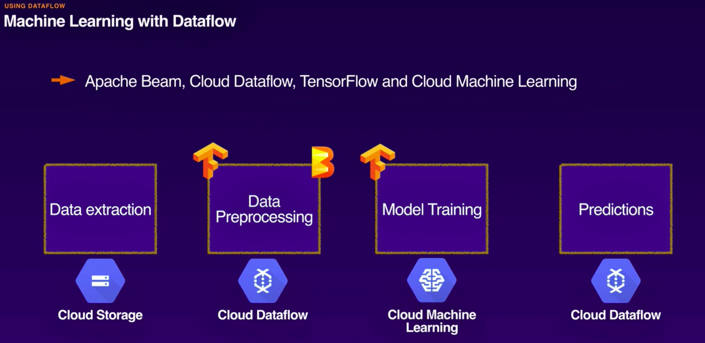

- **Exam Tips**:
  - Apache Beam and Dataflow are preferred solution for streaming data. Dataproc and Spark may be suitable for batch workloads.
  - Pipelines represents the complete set of stages required to read data, performe any transmormations and write data. 
  - A PCollection represents a multi-element dataset that is processed by the pipeline.
  - Understand some of the functions of the SDK:
    - ParDo is the core parallel processing function of Apache Beam, mhich can transform elements of an input PCollection into an output PCollection.
    - DoFn is a template you use to create user-defined functions (UDF) that are referenced by a ParDo.
  - Sources are where data is read from and Sinks where data gets wirtten. 
  - Windows and Watermarks;
    - Windowing allows streaming data to be grouped into finite collections according to time or session-based windows. This is very usefull when you need to impose ordering or constraints on Pub/Sub. 
    - A watermark indicates when Dataflow expects all data in a window to have arrived. Data that arrives with timestamp that's inside window but past the watermark is considered late data. 
  - Dataflow vs Cloud Composer:
    - Dataflow is normally the preferred option for data ingestion pipelines. Cloud Composer may sometimes be used for ad-hob orchestration, or to manual control of Dataflow pipelines themselves. 

- Quiz:
  - What is the purpose of a trigger in Cloud Dataflow?
    - Triggers determine when to emit output data, and behave differently for bounded and unbounded data. Triggers determine when to emit aggregated results as data arrives. For bounded data, results are emitted after all of the input has been processed. For unbounded data, results are emitted when the watermark passes the end of the window, indicating that the system believes all input data for that window has been processed.
  - What is a sensible way to test a Cloud Dataflow pipeline before deploying it to production?
    - Remove DataflowRunner from PipelineOptions, to allow the pipeline to run locally.
  - Which transformation can be used to process collections of key/value pairs, in a similar fashion to the shuffle phase of a map/shuffle/reduce-style algorithm?
    - GroupByKey is a Beam transform for processing collections of key/value pairs. It’s a parallel reduction operation, analogous to the Shuffle phase of a Map/Shuffle/Reduce-style algorithm. CoGroupByKey performs a relational join of two or more key/value PCollections that have the same key type. Combine simply combines elements, and Partition splits elements into smaller collections.
  - What is a pipeline in the context of Cloud Dataflow?
    - A pipeline represents the entire series of steps involved in ingesting data, transforming that data and writing output.
  - What method could you use to help compute averages when dealing with unbounded/streaming data?
    - A sliding time window represents time intervals in the data stream; however, sliding time windows can overlap. This kind of windowing is useful for taking running averages of data. For example, using sliding time windows you could compute a running average of the past 60 seconds’ worth of data, updated every 30 seconds.
  - What would be the most secure way to grant access from Dataflow in Project A to a Cloud Storage bucket in Project B?
    - Create a custom service account to use as the Dataflow controller service account in Project A. Grant storage viewer access for the bucket in Project B to the custom service account in Project A. By default, compute workers use your project’s Compute Engine service account as the controller service account. For more fine-grained access and control, you can use a custom service account from your job's project as the user-managed controller service account, then grant the necessary permissions to that service account from the other project.
  - Which operation can be used to invoke a user-specified function of each element of an input PCollection?
    - ParDo is a Beam transform for generic parallel processing. The ParDo processing paradigm is similar to the 'Map' phase of a Map/Shuffle/Reduce-style algorithm: a ParDo transform considers each element in the input PCollection, performs some processing function (your user code) on that element, and emits zero, one, or multiple elements to an output PCollection.

## Managed Spark with Cloud Dataproc

- Dataproc overview
  - Managed cluster service for hadoop and spark.
  - Master node, worker nodes. 
  - Cluster comes with hadoop, spark, zookeper, hive, pig, Tez, Jupyter notebook and GCS connetor.
  - Cluster actions complete in 90 seconds.
  - Pay-per-second minimum 1 minute.
  - Scale up/down or turn off at will.
  - Can auto-scale.
  - Monitor with Stackdriver. 

- Dataproc basics. 
  - Regional or global.
  - Single node cluster. 
  - Standard cluster. Can add preemptible but without HDFS.
  - High Availability Cluster. 
  - Sumitting jobs: console, gcloud cli, dataproc API and SSH to Master Node. 
  - Jobs: hadoop, spark, hive, pyspark, sql etc.
  - Common stackdriver metrics to monitoring clusters:
    - cluster/yarn/allocated_memory_percentage.
    - cluster/hdfs/storage_utilization.
    - cluster/hdfs/unhealthy_blocks.

- Advanced dataproc:
  - Custom clusters. 
    - Custom cluster properties. 
    - Initialization actions.
    - Custom Java/Scala dependencies. 
  - Auto-scale in yaml. 
    - cooldown period.
  - gracefulDecommissionTimeout: to don't remove busy nodes. 
  - Do not use autoscaling with:
    - High Availability clusters.
    - HDFS (use cloud storage instead)
    - Spark Structured Streaming. 
    - Idle clusters.
  - Workflow templates. 
  - Local SSDs.
  - GPUs (require custom init).

- **Exam Tips**:
  - Migrate hadoop and spark: dataproc.
  - The biggest benefits of dataproc over a self-managed hadoop or spark cluster are the ease of scaling, being able to use cloud storage instead of HDFS, and the connectors to other GCP services including BigQuery and BigTable.
  - Clusters options. 
  - Get to know the open-source ecosystem.
  - Cloud Dataflow is better por streaming. 

- Quiz:
  - Since preemptibles can be reclaimed at any time, preemptible workers do not store data.
  - Cloud Dataproc has built-in integration with BigQuery, Cloud Storage, Cloud Bigtable, Stackdriver Logging, and Stackdriver Monitoring.
  -  customer wants to run Spark jobs on a low-cost ephemeral Dataproc cluster, utilizing preemptible workers wherever possible, but needs to store the results of Dataproc jobs persistently. What would you recommend?
    - Use the Cloud Storage connector, and specify GCS locations for the input and output of jobs.
  - Cloud Dataproc clusters can be provisioned with a custom image that includes a user's pre-installed packages. You could alternatively use initialization actions to install the additional components, but this would be less efficient and incur more running time for ephemeral clusters.

## NoSQL Data with Cloud BigTable
#### Rewatch this section

- BigTable Concepts
  - Managed wide-column NoSQL Database.
  - High throughput.
  - Low latency.
  - Scalability.
  - High availability.
  - HBase created as an open-source implementaion of the BigTable model.
  - Sparse DB.
  - Blocks of contiguous rows are sharded into tablets.
  - Data stored in Google Colossus.
  - Use cases:
    - Marketing and financial transactional data.
    - Time Series and IoT.
  
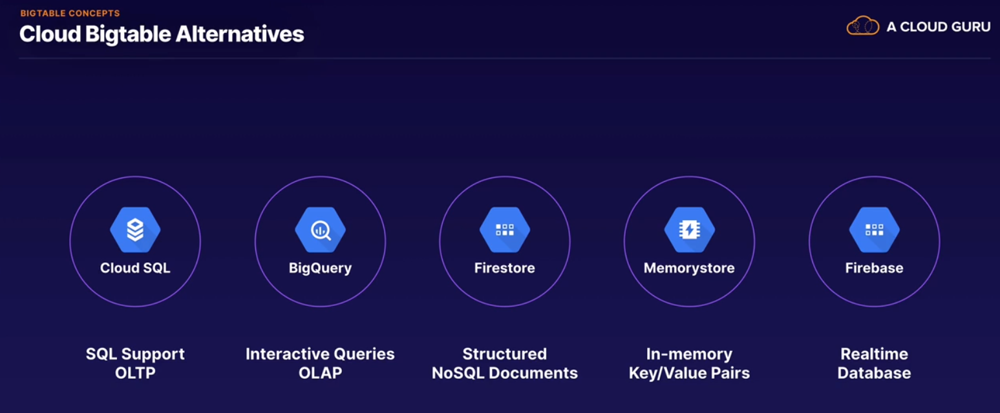

- BigTable Architecture
  - Instance: instance type, storage type, app profiles. 
    - Cluster: 
      - Node.
  - Colossus: store data.
  - Production vs Development.
  - Storage: SSD and HDD.
  - Aplication profiles: custom app-specific settings for handling incoming connections.
  - Single (single row transactions) vs multicluster routing.
  - Instances can run up to four clusters.
  - Clusters exist in a single zone.
  - Up to 30 nodes per projetc (soft limit).
  - Maximum of 1000 tables per instance.
  - Security:
    - Cloud IAM roles:
      - Applied at the project or instance level to:
        - Restrict access or administration.
        - Restrict reads and writes.
        - Restrict development or production access. 

- BigTable data model.
  - Empty cells won't consume any space in the table.
  - Row up to 10 Mb.
  - Garbage collector (policy).
  - Each cells can have multiple version.

- BigTable Schema Design. Rewatch this lecture.***
  - Query planning.
    - Field promotion.
      - Never put timestamp in the start of row key.

- BigTable Advanced Topics:
  - Monitoring: stackdriver and Console.
    - Average CPU and hottest node.

- **Exam Tips**:
  - Know when to choose BigTable.
    - Many exam questions are based on choosing the right product for the workload. If migrating from onpremise environment, look for HBase. Also consider when BigTable beats BigQuery. Look for time-series data, or use cases where latency in an issue. 
  - Understand BigTable Architecture.
    - You should understand the conepts of a instance and a cluster, where BigTable stores data, and how tablets are re-balanced by the service between nodes. 
  - Understand row keys.
    - This can't be overstated: the linear scale and performance of BigTable depends on good row keys. Make sure you have a solid understanding of row key design, as in the exam may have to either choose an optimal row key, or point out the flaws in a bad one. 
  - Tall vs Wide.
    - Understande the difference between a wide table and a tall table. Wide tables store multiple columns for a given row key where the query pattern is likely to require all the information about a single entity. Tall tables suit time-series or graph data and often only contain a single column.

- **Quiz**:
  - Which of these identifiers would make a good component of a row key?
    - A reverse domain name would make a good row key, especially if each row's data overlaps with adjacent rows. This allows Cloud Bigtable to compress your data more efficiently. See: https://cloud.google.com/bigtable/docs/schema-design 
    Good row key design is essential. Cloud Bigtable queries use the row key, a row key prefix, or a row range to retrieve the data. Other types of queries trigger a full table scan, which is much less efficient. Using human-readable values makes it much easier to troubleshoot issues with Cloud Bigtable. See: https://cloud.google.com/bigtable/docs/schema-design
  - If you have 2 replicating clusters in your Bigtable instance, how can you ensure that your application will be guaranteed strong consistency for its transactions?
    - Strong consistency can only be achieved using single-cluster routing. Eventual consistency is normally quick but can take several minutes depending on the distance between clusters. If your application requires strong consistency, refactoring is unlikely to be an option without a complete redesign.
  - What action should you take if you observe that Bigtable performance is poor on a subset of queries?
    - Use the Key Visualizer tool to identify hot spots and consider changing how the row key distributes rows. If a subset of queries are performing poorly, there is likely a hot spot being caused by the row key design. Key Visualizer provides a heatmap of the load across your entire table in a way that is difficult to understand using standard debugging techniques. Increasing the size of a cluster is not a long term solution, and adding additional clusters will not affect write throughput.
  - For which types of data workload would Bigtable not be a good fit?
    - Cloud Bigtable does not support SQL queries or the multiple indexes required for true relational data. If your dataset is too small, Bigtable won't be able to balance tables in a way that optimizes performance.
  - Which of these identifiers would make a bad component of a row key?
    - Timestamp at the start of a multi-component row key. Sequential numeric ID.
  - How does Bigtable manage rows, tables, and tablets?
    - Tables are sorted into contiguous rows and are sharded into tablets. A Cloud Bigtable table is sharded into blocks of contiguous rows, called tablets, to help balance the workload of queries.
  - How does Bigtable manage the storage of tablets?
    - Tablets are stored in Google Colossus, but a cluster node has a limit on how much storage it can process. Data is never stored in Cloud Bigtable nodes themselves; each node has pointers to a set of tablets that are stored on Colossus. However, CPU resources are required for a node to manage all of its associated tablets.
  - In a region with 4 zones, what is the maximum number of Bigtable clusters available?
    - 4 . In a region with 4 zones, a BigTable instance can contain up to 4 clusters. Compute Engine is a red herring, it has nothing to do with Cloud Bigtable.

## Data Analytics with BigQuery

- BigQuery Basics:
  - Peta-byte, scale, serverless, highly-scalable cloud enterprise data warehouse.
  - Supports Standard SQL.
  - Support federated data.
  - Automatic backups.
  - Web console, cli (bq), client libraries.
  - Dataset kind of database. 
  - Ingestion: real time events, batch sources.
    
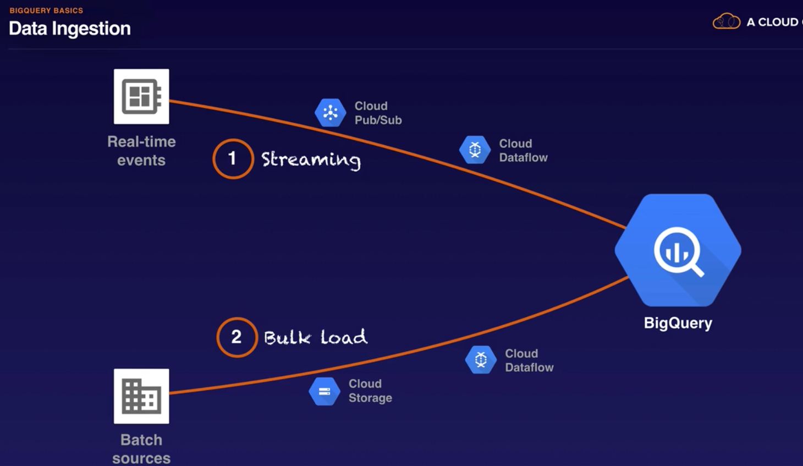

  - Job: action that is run in BQ on your behalf:
    - Load.
    - Export.
    - Query.
    - Copy.

  - Query priority: Interactively (default), batch.
  - Tables can be partitioned.
  - Capacitor columnar data format.
    - Sopports semi-structured data (nested and repeate fields).

  - Record (struct) data type.
  - Import: csv, json (newline delimited), avro (preferential), parquet, ORC, cloud datastore, cloud firestore.
  - A view is a virtual table defined by a SQL query.
    - Benefits:
      - Control access to data.
      - Reduce query complexity.
      - Constructing logical tables.
      - Ability to create authorized view.
    - Limitations:
      -  Cannot export data.
      - Cannot combine sqls.
      - Cannot use json API to retrieve data from view.
      - no user defined functions.
      - no wildcard table reference.
      - limited to 1000 authorized views per dataset.
  
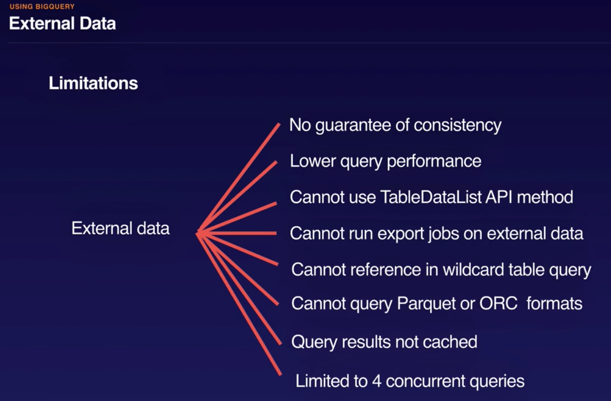

- Table partitioning and clustering
  - Why use partition:
    - Improve query performance.
    - Control costs.

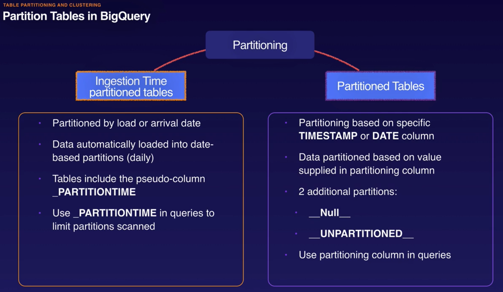

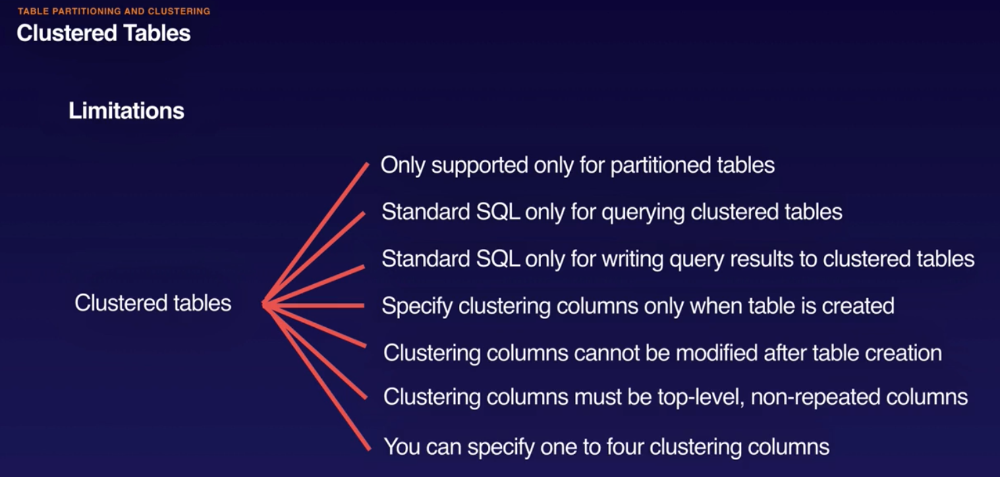

- Querying clustered tables:
  - Filter clustered columns in the order they were specified.
  - Avoid using cluster columns in complex expressions.

- Best practices using BQ
  - Slot: unit of computacional capacity required to execute SQL query.
  - Number of slots: query size and complexity.
  - BQ automatically manages slots quotas.
  - Stackdriver to see slots usage.
  - Query plan.

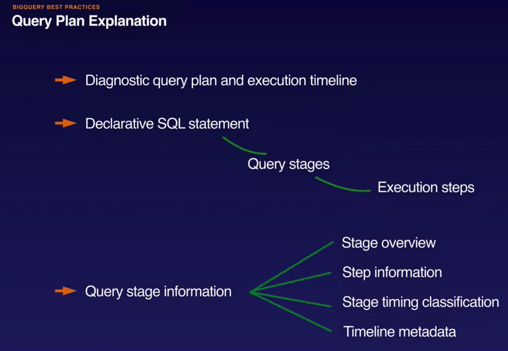

  - Controlling costs:
    - Avoid using SELECT *
    - Use Preview to sample data.
    - Price queries before executing them.
    - Using limit does not affect cost.
    - Partition by date.
    - Materialise query result in stages.
    - Use streaming inserts with caution.
  - Query performance:
    - Input data and data sources.
      - Prune partitioned queries.
      - Denormalise data whener possible.
      - Use external data source appropriately.
      - Avoid excessive wildcard tables.
    - Shuffling.
    - Query computation.
      - Avoid repeatedly transforming data via SQL queries.
      - Avoid JavaScript user-defined functions.
      - Order query operations to maximise performance.
      - Optimise JOIN patterns.
    - Materialisation.
    - SQL anti-patterns.
  - Optimising storage.

- Securing BQ:
  - Roles related to BQ.
  - Primite roles: at the project level (owener, editor and viewer).
  - Predefined roles: granular, service-specific, GCP managed.
    - Role: bigquery.admin, bigquery.dataViewer.
    - Permissions: bigquery.jobs.create, biquery.datasets.create. 
  - Custom roles.
  - Sensitive data: credit card, medical info, social security, names, address.
    - CLOUD DLP (Data Loss Prevention):
      - Fully managed.
      - Identity and protect sensitive data at scale.
  - DEK: Data Encryption Key.

- BQ monitoring and logging:
  - Stackdriver log streams: admin, system, data.
  - Dashboard, Alerts. 
  - CloudAudit Logs: autiData (old), BigQueryAuditMetadata.

- Machine Learning with BQ:
  - BQ ML.
  - bq cli, API BQ, web console, jupyter.
  - Linear regression, binary logistic regression, k-means, multi-class logistic regression.
  - Models trained and evaluated using sql. 

- **Exam Tips**:
  - Understand good organizational design:
    - You should be able to design sustems that use BQ at an organizational and project level. This includes considerations of how different teams should be grated different types of access to BQ, and how theses decisions also affect cost control. 
  - Learn the most commom roles.
  - Consider cost when design queries.
  - Use partition.
  - Optimize query operations and JOINS. 

- **Quiz**:

  - Your company stores data in BigQuery for long-term and short-term analytics queries. Most of the jobs only need to study the last 7 days of data. Over time, the cost of queries keeps going up. How can you redesign the database to lower the cost of the most frequent queries?
    - Use DATE partitioned tables. A partitioned table is a special table that is divided into segments, called partitions, that make it easier to manage and query your data. By dividing a large table into smaller partitions, you can improve query performance, and you can control costs by reducing the number of bytes read by a query.
  - What could you consider to improve BigQuery performance for queries that use filters or aggregation against particular columns?
    - Use clustered partitioned tables. Clustering can improve the performance of certain types of queries such as queries that use filter clauses and queries that aggregate data. When you submit a query that contains a clause that filters data based on the clustering columns, BigQuery uses the sorted blocks to eliminate scans of unnecessary data.
  - You are required to share a subset of data from a BigQuery data set with a 3rd party analytics team. The data may change over time, and you should not grant unnecessary projects permissions to this team if you can avoid it. How should you proceed?
    - Create an authorized view based on a specific query for the subset of data, and provide access for the team only to that view. An authorized view allows you to share query results with particular users and groups without giving them access to the underlying tables.
  - You are required to load a large volume of data into BigQuery that does contain some duplication. What should you do to ensure the best query performance once the data is loaded?
    - Denormalize the data by using nested or repeated fields. BigQuery performs best when your data is denormalized. Rather than preserving a relational schema, such as a star or snowflake schema, you can improve performance by denormalizing your data and taking advantage of nested and repeated fields.

## Exploration with Cloud Datalab
- Datalab concepts:
  - Jupyter notebook.
  - Separate command from gcloud.
  - Command datalab.

## Vizualization with Cloud Data Studio
- BI: reporting, analytics, dashboards.
- Discrete variables: fixed values. 
- Continuous variable: any value in certain range.

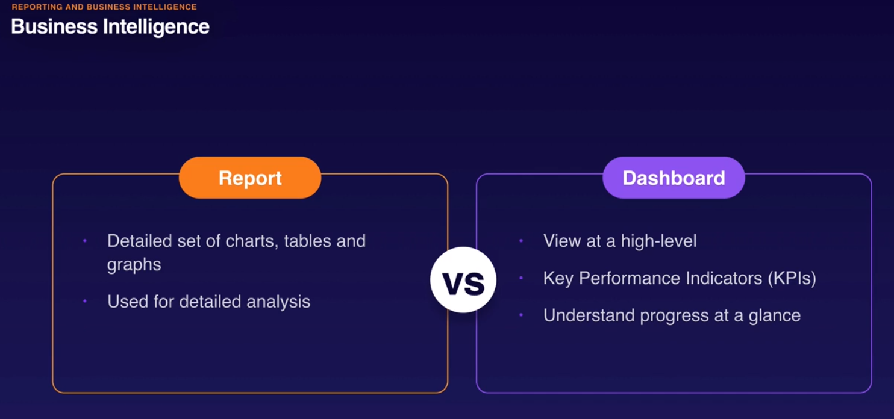

## Orchestration with Cloud Composer
- Apache Airflow managed. 

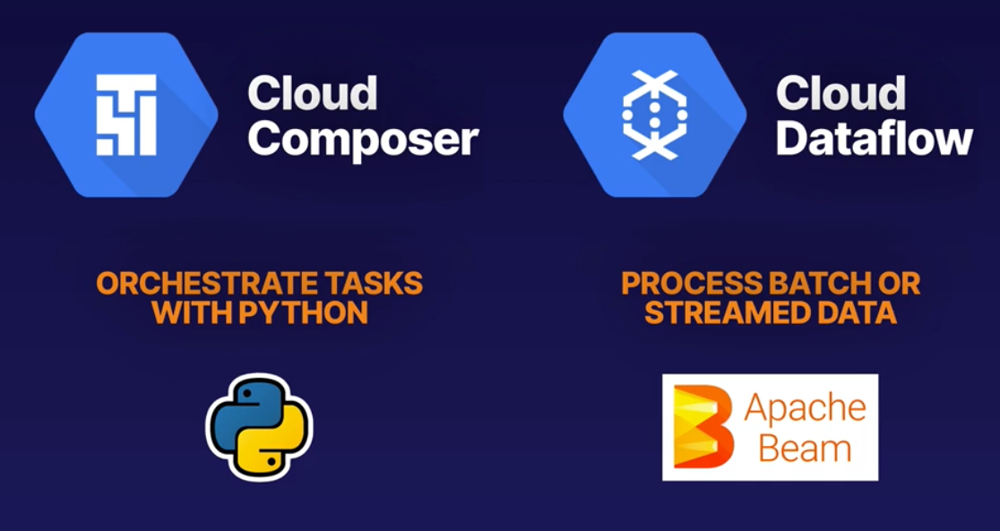

## Machine Learning with Tensorflow:

- **Quiz**:
- Which of these problems would require a regression model?
  - Estimating the price of a house in 5 years time. Regression models attempt to predict numerical output based on known historical data and features.
- What are hyperparameters used for in machine learning?
  - Hyperparameters are the variables that govern the training process itself. Your hyperparameters are the variables that govern the training process itself. They are configuration variables, not directly related to the training data.
- Which statement correctly describes the relationship between Keras and TensorFlow?
  - Keras is a high-level deep-learning Python library that includes support for TensorFlow functionality. Keras is a high-level neural networks API, written in Python and capable of running on top of TensorFlow, CNTK, or Theano.

## Using Pre-Trained ML Cloud APIs

- Google AI: AI building blocks (APIs), AI HUB, AI Platform.

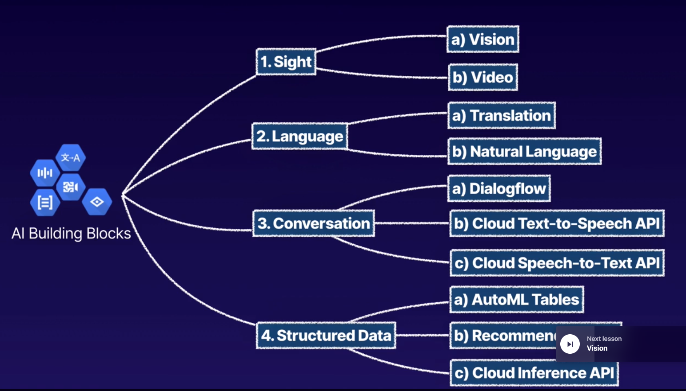

- **Quiz**:
- What categories are returned in the safeSearchAnnotation response from the Cloud Vision API?
  - Adult, Spoof, Medical, Violence, Racy. SafeSearch Detection detects explicit content such as adult content or violent content within an image. This feature uses five categories (adult, spoof, medical, violence, and racy) and returns the likelihood that each is present in a given image.
- What would be the best approach to transcribing a conversation from a recorded telephone call?
  - Use asynchronous speech recognition. Set enableSpeakerDiarization to true and the model to 'phone_call' in the RecognitionConfig. Speech-to-Text can recognize multiple speakers in the same audio clip using Speaker Diarization. Use asynchronous speech recognition to recognize audio that is longer than a minute.
- f you make a request to the documents:analyzeEntities endpoint of the Natural Language API, what sort of information can you expect in the response?
  - An array of Entity objects that will each contain metadata including a Wikipedia URL and Knowledge Graph MID, if available. Entity Analysis inspects the given text for known entities (proper nouns such as public figures, landmarks, etc.), and returns information about those entities.
- How should you interpret the documentSentiment response from the Natural Language API?
  - 'score' represents an overall emotional leaning of a test from -1.0 (negative) to 1.0 (positive), and 'magnitude' indicates the overall strength of emotion. 'magnitude' is not normalized so longer text blocks may have greater magnitudes. A response value to the Gettysburg Address of 0.2 score indicates a document which is slightly positive in emotion, while the value of 3.6 indicates a relatively emotional document, given its small size (of about a paragraph). Note that the first sentence of the Gettysburg address contains a very high positive score of 0.8.
- How would you begin to design a Dialogflow agent that can answer requests for weather forecasts?
  - Create an Intent for requesting a weather forecast, specify training phrases based on real-world speech patterns that would ask this question, and define the structured parameters that can be used to create a response.An intent categorizes an end-user's intention for one conversation turn. Training phrases are example phrases for what end-users might say. When building an agent, you control how data is extracted by annotating parts of your training phrases and configuring the associated parameters.
- What would be the most efficient way to transcribe audio from an input video while also filtering out profanity?
  - Use the Cloud Video Intelligence API, requesting the SPEECH_TRANSCRIPTION feature, and set filterProfanity to true in the speechTranscriptionConfig. The Video Intelligence API can transcribe speech to text from supported video files. Use the filterProfanity option to filter out known profanities in transcriptions. Matched words are replaced with the leading character of the word followed by asterisks.
- What are some of the properties that can be returned by the Cloud Vision API when requesting the FACE_DETECTION feature?
  - Positions of the features of the face (eg. eyes and noise), likelihood of certain emotions, likelihood of headwear. Face Detection detects multiple faces within an image along with the associated key facial attributes such as emotional state or wearing headwear. Specific individual Facial Recognition is not supported.
- How do you provide GCP authentication credentials when making request to Cloud MP APIs from the command line with curl?
  - Configure authentication with gcloud, then use 'print-access-token' to include an authorization bearer in the HTTP request. The gcloud tool must be properly configured and authenticated. It can then be used to generate access tokens which can be included in the header of the HTTP request.
- Which features could you include in your request to the Cloud Vision API to detect text in images?
  - TEXT_DETECTION and DOCUMENT_TEXT_DETECTION. TEXT_DETECTION detects and extracts text from any image. DOCUMENT_TEXT_DETECTION also extracts text from an image, but the response is optimized for dense text and documents.

## AutoML Platform

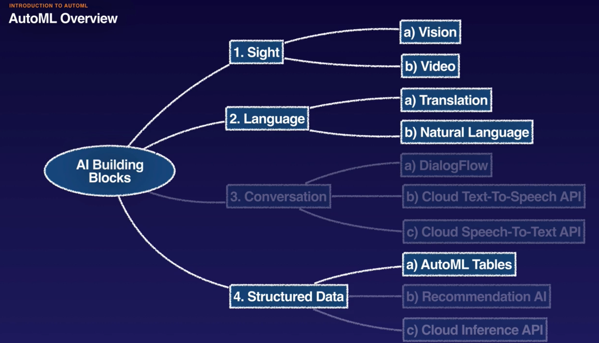

- Transfer learning.

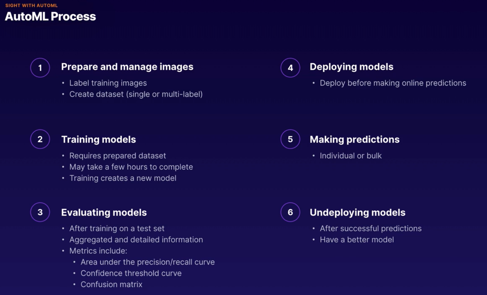

- AutoML Vision Edge: export custom trained models for edge devices.

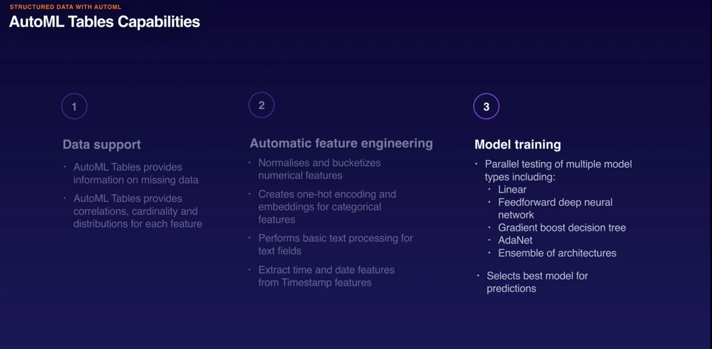

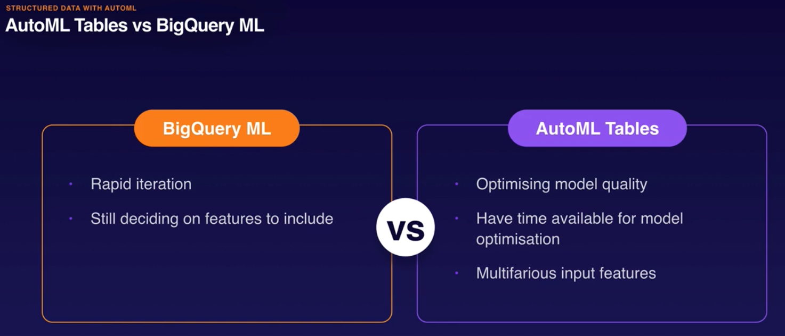

- **Quiz**:
  - You have a large number of images that you wish to process through a custom AutoML Vision model. Time is not a factor, but cost is. Which approach should you take?
    - Make an asynchronous prediction request for the entire batch of images using the batchPredict method. Batch prediction often offers a lower cost per inference and higher throughput than synchronous (online) prediction. However, batch prediction produces a long-running operation (LRO), meaning that results are only available once the LRO has completed.
  - You wish to build an AutoML Natural Language model for classifying some documents with user-defined labels. How can you ensure you are providing quality training data for the model?
    - Ensure you provide at minimum 10 training documents per label, but ideally 100 times more documents for the most common label than for the least common label. Quality training data for an AutoML Natural Language classification model should contain varied input documents, with a minimum of 10 documents per label, and ideally 100 times more documents for the most common label than for the least common label. The maximum number of documents for training data is 1,000,000.
  - How can you import training data into an AutoML Natural Language dataset?
    - As TXT, PDF, TIF or ZIP files, or as a CSV containing references to documents and training labels, from a local upload or Cloud Storage bucket. You can import document URIs and labels for documents from a CSV file stored in a Cloud Storage bucket, and upload training documents directly from your local computer or a Cloud Storage bucket.
  - Which AutoML Vision feature would you use to detect multiple objects in an image?
    - Object localization. Object localization detects multiple objects in an image and provides information about the object and where the object was found in the image.
  - You're developing a mobile application that allows a food processing business to detect fruit that has gone bad. Staff at warehouses will use mobile devices to take pictures of fruit to determine whether it should be discarded. Which GCP services could you use to accomplish this?
    - Train an AutoML Vision model using labeled images of fruit that has gone bad. Use AutoML Vision Edge in ML Kit (now custom model API) to deploy the custom model to mobile devices using ML Kit client libraries. The AutoML Vision Edge in ML Kit (now part of the custom model API) can host trained ML models on mobile devices, or connect to AutoML models in the cloud. It can also be used to gather training data for building models.

## Operationalizing Machine Learning Models

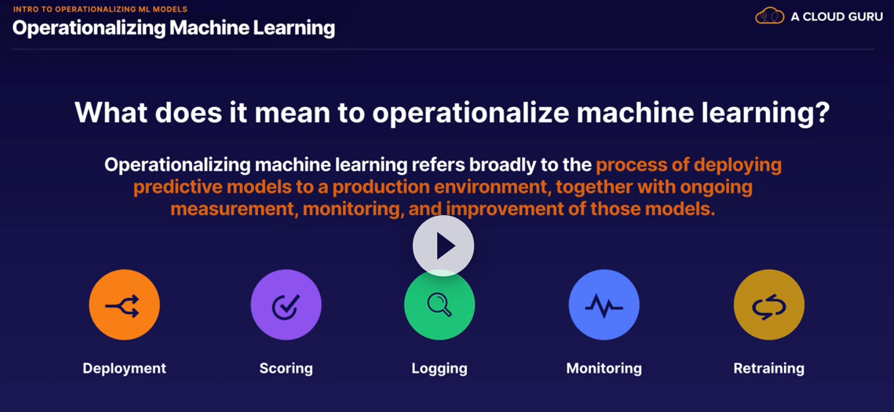

- Kubeflow: ML toolkit for Kubernetes.
  - Web UI or cli. 

## Data Security and Industry Regulation

- Principle of least privilege.
- Org >> Folder >> Projects >> Resources.
- Grant roles to groups instead of individual.
- Check most important roles for the most important resources. 
- GCP DLP: Data Loss Prevention: redact or remove sensitive data in text and images. Can become expensive. 

## Dataprep

- Exploring, cleaning and preparing data. 
- Visually define transformations.
- Export to Cloud dataflow.
- Trifacta. 

- Flows, datasets, recipes (steps to transformations), automator.

# Qwikilabs Stuff

## Google Cloud Big Data and Machine Learning Fundamentals: 

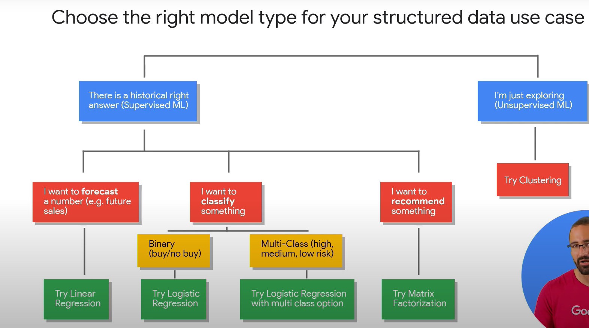

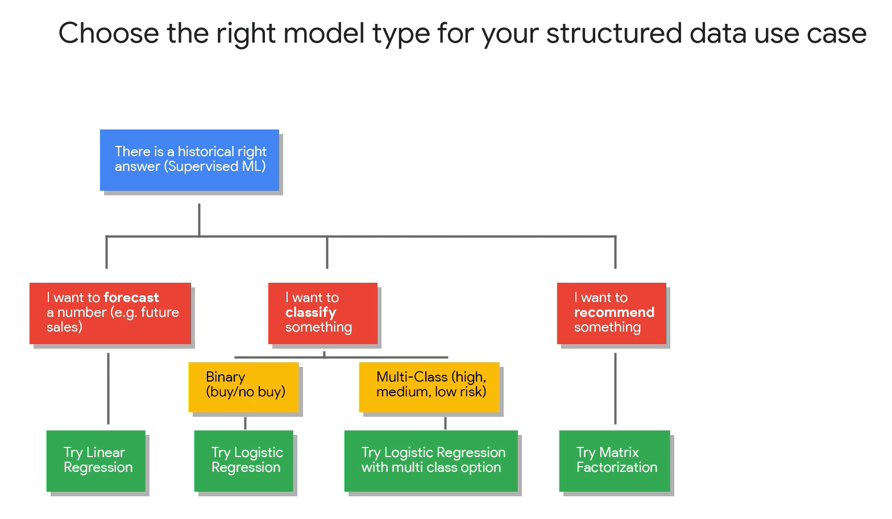

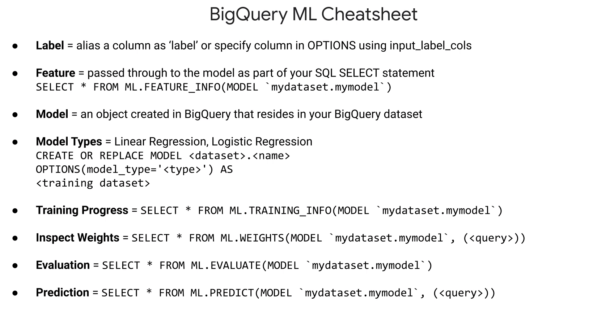

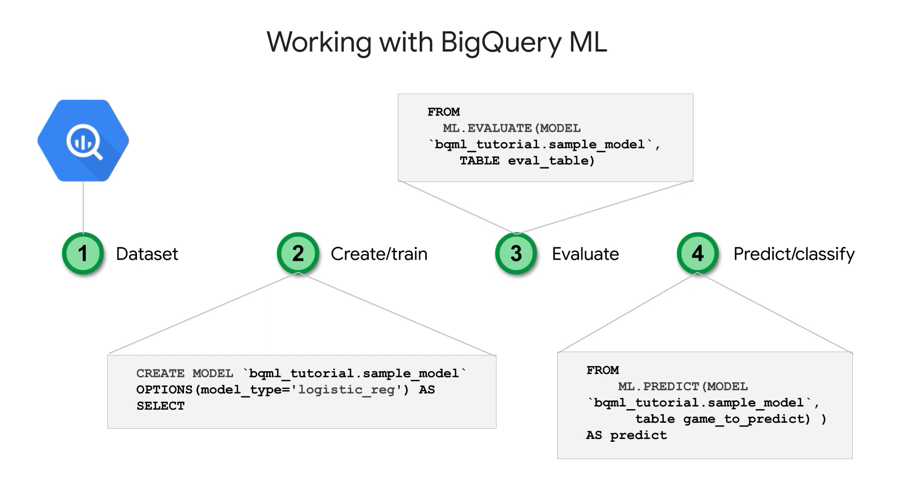

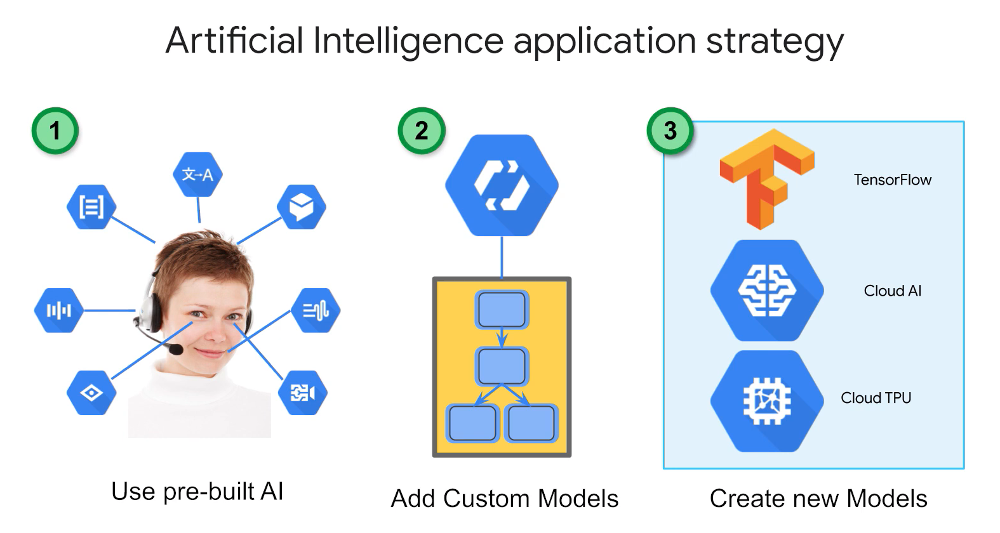

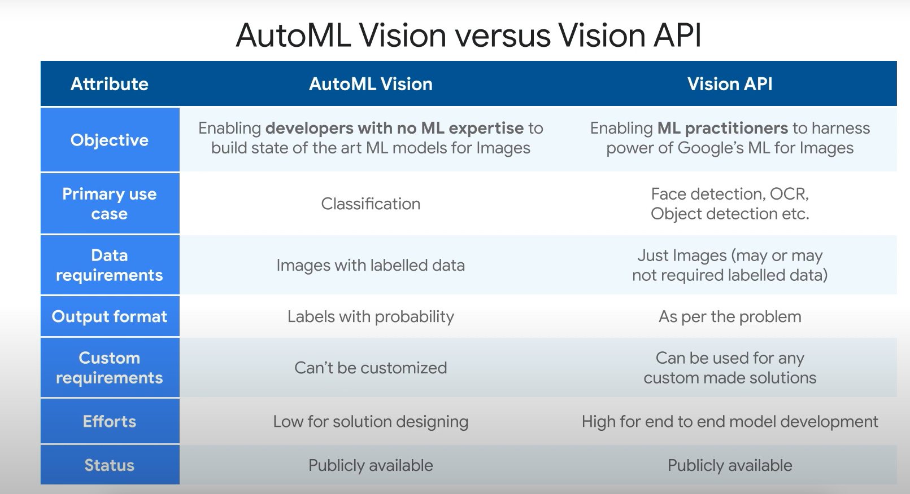

